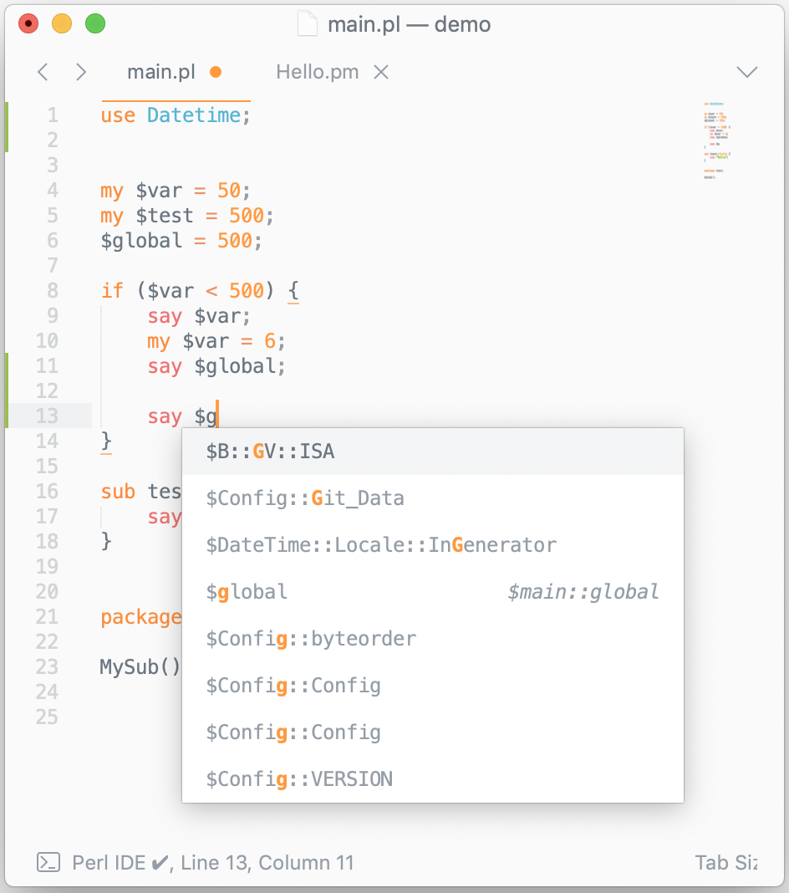
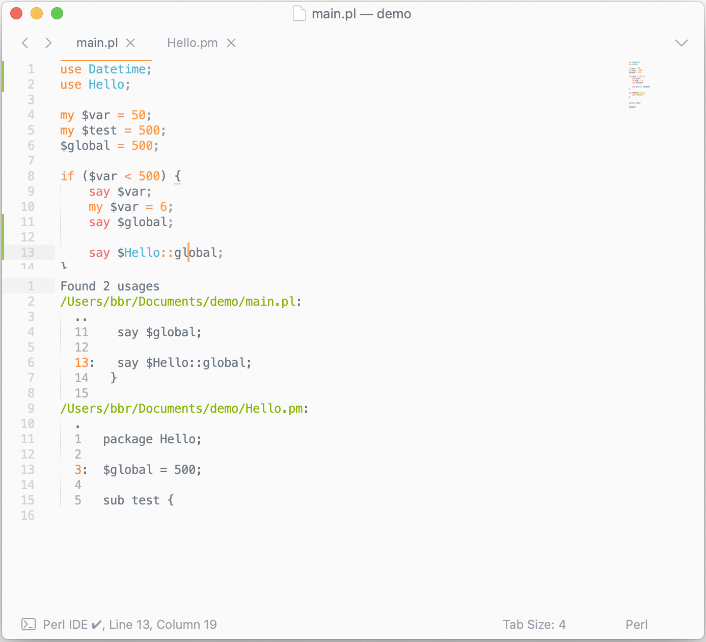

# Sublime Perl IDE
IDE like features for Perl 5, in sublime text 3

## Features

* Autocompletion
* Find usages
* Goto declaration
* Rename symbols

## Installation

**Only x86-64 mac and linux supported**

Install via package control (coming soon)

If you wish, you can attempt to install on non x86-64 systems. 
1. Download and compile [Perl-Ide-Server](https://github.com/BenBanerjeeRichards/perl-ide-server). Ensure you build in **release**.
2. Place the release executable somewhere safe
3. Set the environment variable `PERL_IDE_SERVER` to the path locating the executable you just built.